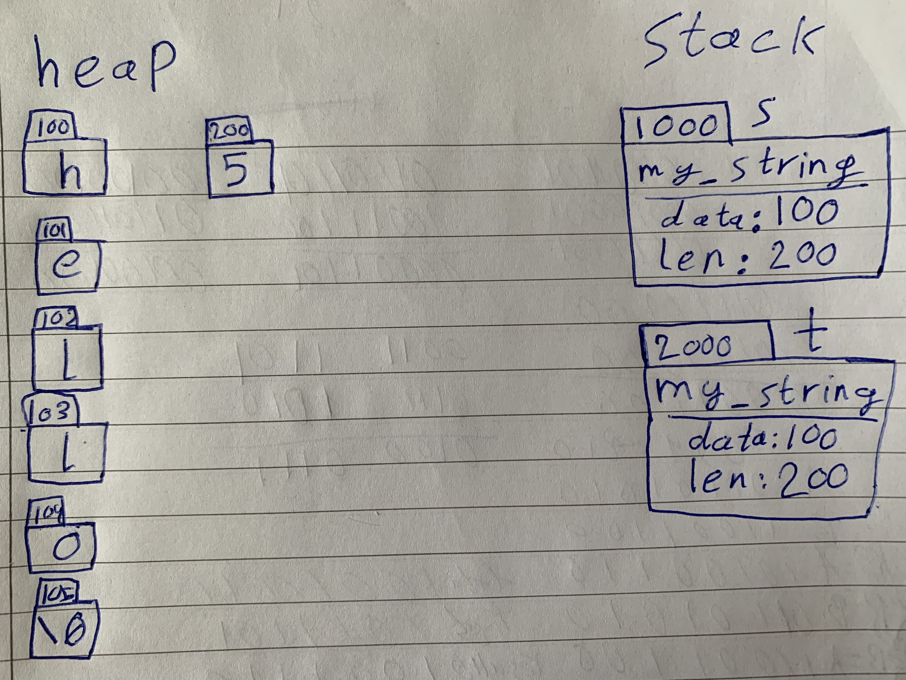

# Table of contents
- [Task 1](#task-1)
- [Task 2](#task-2)
- [Task 3](#task-3)
- [Task 4](#task-4)

<small><i><a href='http://ecotrust-canada.github.io/markdown-toc/'>Table of contents generated with markdown-toc</a></i></small>

# How to run

use the following command to run any of the tasks:

```bash
$ cd task-<task number>
$ clang++ -g -o main my_string.cpp main.cpp
$ ./main
```

where `<task number>` is 1, 2, 3 or 4

# Task 1

## Introduction

The `my_string` class is a custom string implementation that provides basic string manipulation capabilities. The key point of this class is to be able to share strings between multiple instances throw the copy constructor and copy assignment

## Class Overview

### Constructors

- **Default Constructor**: Creates an empty `my_string`. Usage:
    ```cpp
    my_string str;
    ```
- **Constructor with C-style String**: Initializes a `my_string` object with the content of a C-style string. Usage:
    ```cpp
    my_string str("Hello, World!");
    ```
- **Copy Constructor**: Initializes a `my_string` by copying the content of another `my_string`. Usage:
    ```cpp
    my_string str1("Hello");
    my_string str2(str1);
    ```

### Assignment

- **Copy Assignment Operator**: Assigns the content of another `my_string` to the current `my_string`. Usage:
    ```cpp
    my_string str1("Hello");
    my_string str2;
    str2 = str1;
    ```

### Member Functions

- **get_char**: Retrieve a character at a specified index in the string. Usage:
    ```cpp
    my_string str("Hello World")
    char c = str.get_char(4);
    std::cout << c;
    ```
    output:
    ```output
    o
    ```

- **set_char**: Set a character at a specified index in the string to a new character. Usage:
    ```cpp
    my_string str("Hello World")
    str.set_char(4, 'F')
    char c = str.get_char(4);
    std::cout << c;
    ```
    output
    ```output
    F
    ```

- **print**: Prints the contents of the `my_string` to the standard output. Usage:
    ```cpp
    my_string str("Hello World")
    str.print();
    ```
    output:
    ```output
    Hello World
    ```

## Memory Management

The `my_string` class manages memory automatically. It allocates memory for the string data dynamically and handles copying for the copy constructor and assignment. However, it's important to note that the destructor is unimplemented.

**Note**: since they use the same memory, whenever `set_char` is used, all objects will be updated like the in following example

```cpp
#include "my_string.hpp"

int main() {
    my_string s("hello");
    my_string t = s;
    t.print();
    t.set_char(1, 'E');
    t.print();
    s.print();
}
```
output:
```
hello
hEllo
hEllo
```

## Memory Management Illustration

We will use the following code to explain how memory is managed here:

```cpp
#include "my_string.hpp"

int main() {
    my_string s("hello");
    {
        my_string t = s;
    }
}
```



When object `s` is created it will be allocated on the stack for `main` and the string data and length will be allocated memory on the heap. Next, upon the creation of object `t`, the copy constructor copies the address of the first character in the string and length allocated on the heap when `s` was created, so now they both share the same memory for string and length. Once `t` goes out of scope and gets freed by the RAII system, the pointers data and len are deleted but the data they are pointing to stay since it was not freed in the destructor. Same thing when `s` is deleted at the end of `main`, thus **resulting in a data leak**, which will be addressed in task 2.

## Error Hndling

The `my_string` class includes error checking for out-of-bounds access. If you attempt to access an index outside the valid boundaries of the string, it will throw a `std::out_of_range` exception. Example:
```cpp
my_string str("Hello World")
char c = str.get_char(4);
```
output:
```output
terminate called after throwing an instance of 'std::out_of_range'
  what():  index out of range
```

# Task 2

## Introduction

The `my_string` used in this task builds on top of the `my_string` created in task 1, it aims to solve the memory leak issue caused when an object is deleted but the string stored in a it lives until the end of the program by introducing a reference counter that counts the number of copies and freeing the data when all objects are gone.

## Class Overview

### Constructors and Destructors

- **Default Constructor**: same as task 1, but also initializes the reference counter to 1.

- **Constructor with C-style String**: same as task 1, but also initializes the reference counter to 1.

- **Copy Constructor**: same as task 1, but also increments the reference counter by 1.

- **Destructor**: decrements the reference counter and deletes the data if it reaches 0

### Assignment

- **Copy Assignment Operator**: Assigns the content of another `my_string` to the current `my_string`. Usage:
    ```cpp
    my_string str1("Hello");
    my_string str2;
    str2 = str1;
    ```
    Note: first it decrements the current counter, and if it hits 0 it deletes it, then it increments the new counter. So it does both destruction and copy.

### Member Functions

- **get_char**: same as task 1.

- **set_char**: same as task 1.

- **print**: same as task 1, but also prints the number of copies. Usage:
    ```cpp
    my_string str("Hello World")
    str.print();
    {
        my_string str2 = str;
        str.print();
        str2.print();
    }
    str.print()
    ```
    output:
    ```output
    Hello World [1]
    Hello World [2]
    Hello World [2]
    Hello World [1]
    ```

## Memory Management

As mentioned before, this updated version so it still uses the same way to create the string on the heap, but the difference is the reference counting part, here with every copy it increments, and with every destruction it decrements and once it hits 0 (which means all instances have been deleted) the string, length and reference counter gets freed from the heap.

## Memory Management Illustration


We will use the following code to explain how memory is managed with showing how copy constructor and copy assignment behave:

```cpp
#include "my_string.hpp"

int main() {
    my_string s("hello");
    {
        my_string t = s;
        my_string r("hi");
        r = s;
    }
}
```


The creation and allocation of memory for `s`, `t` and `r` on the heap stays the same as task 1, the only difference is the reference counter which starts at 1 with `s`, then gets incremented to 2 when `t` is created. `r` is then created normally, but when assigned with `s` it got deleted because it was the only instance and then contents of `s` got copies into `r`. Once `t` and `r` went out of scope, the reference counter got decremented. Finally when `s` is deleted by the end of `main` the reference counter hits 0 so now the string, length and reference counter itself gets free from memory

visualization tool is https://pythontutor.com/. note that the code written in there is a simplified version for the tool to be able to parse it, but it still functions exactly the same.

## Error Hndling

Nothing new from task 1

# Task 3

## Introduction

The code for this task is the exact same for task 2, but without freeing the reference counter to be able to use it after it reaches 0, in addition to a getter for the reference counter

## Memory Leak

The main point of this task is to be able to get the reference count to reach 0, but the issue is that once it reaches 0 it gets freed. To solve that, first a new method is introduced to return a pointer to the reference counter called `get_ref_counter()`, and second is by not freeing the reference counter in the destructor.

Now, we can see the reference counter reaching 0 using the following code:

```cpp
#include "my_string.hpp"
#include <iostream>

int main(int argc, char *argv[]) {
    int *counter;
    {
        my_string s("hello world");
        counter = s.get_ref_counter();
    }
    std::cout << *counter;
}
```

# Task 4

## Introduction

The `Rc` class is a template class for implementing a reference-counted smart pointer. This class is designed to manage dynamic memory for objects of any type in a safe and efficient way, ensuring that objects are automatically deallocated when they are no longer in use.

The class simplifies the management of such objects by automatically handling memory allocation, deallocation, and reference counting. When an `Rc` instance is created, it encapsulates a pointer to the object and keeps track of how many Rc instances reference the same object.

## Class Overview

### Constructors, Assignment and Destructors

All the constructors, assignment operator and destructor act the same way they did in task 2 for the `my_string` class except that instead of using a string it uses a pointer to any data type.

### Overloaded Operators

- **Access operator**: allows accessing methods and fields of whatever type is stored within the `Rc`. Usage:
    ```cpp
    Rc rc(new my_string("hello"));
    rc->set_char(1, 'E');
    ```

- **Output stream operator**: print out the objected stored and the number of copies. Usage:
    ```cpp
    Rc rc(new float(3.14f));
    std::cout << rc;
    ```

## Memory Management

Everything about the class relating to reference counting is exactly the same as task 2, so for this section you can refere back to task 2's memory management section.
